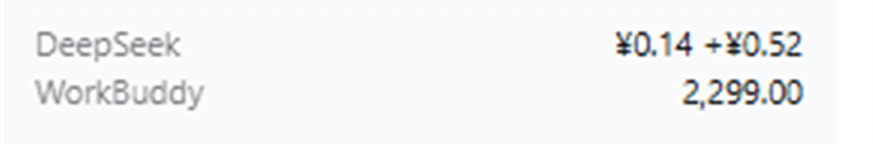

# DSH Dual Balance

[English](./README.en.md) | 中文

在 DeepSeek Harness 侧栏底部同时显示 **DeepSeek 官方余额** 与 **WorkBuddy 剩余积分**，一眼看清两边的钱还剩多少。

```
┌─────────────────────┐
│ DeepSeek      ¥8.91 │
│ WorkBuddy  12,340.00│
└─────────────────────┘
```

用完 WorkBuddy 积分跑任务、又想知道自己的 DeepSeek 官方余额还剩多少时，不用再在两个界面之间来回切。

## 为什么需要它

DSH 里通常同时挂着两套账号：DSH 自己的 DeepSeek 官方账号（走官方计费），以及通过 [dsh-workbuddy-connect](https://github.com/corrinehu/dsh-workbuddy-connect) 接入的 WorkBuddy 账号（走 App 的积分）。两边余额分散在不同设置页里，日常使用中很容易跑到一半才发现某一边见底。

本插件把这两个数字固定放在侧栏底部，每 60 秒刷新一次。

## 功能



- **两个数字并排**：`DeepSeek` 显示官方余额（含赠金时显示为 `¥8.91 +¥2.00`），`WorkBuddy` 显示剩余积分合计。
- **中英双语**：跟随 DSH 的语言设置自动切换。
- **悬停看详情**：鼠标停在区块上，tooltip 给出完整说明——充值余额与赠金的拆分、WorkBuddy 积分来源、未登录状态等。
- **优雅降级**：WorkBuddy 插件没装、没登录，或计费接口报错时，对应一行显示 `未登录` 或 `—`，不影响另一半正常显示，也**不会让 DSH 启动失败**。
- **金额格式对齐官方**：见下方「格式细节」。

## 格式细节

这两个数字的格式不是随手 `toFixed(2)`，而是刻意模仿各自的真实规则：

**DeepSeek 余额**按官方的两位小数截断（`roundDown`）显示，不是四舍五入。余额 `0.148` 在官方页面显示 `0.14`，本插件也显示 `¥0.14`，不会显示成 `0.15`。不足一分的余额收敛显示为 `<¥0.01`——因为屏幕上的 `¥0.00` 会被误读成「已用尽」，而实际还差一点点。

**WorkBuddy 积分**同样按两位小数截断。上游本就以两位小数上报，多出来的位数是二进制浮点噪声，所以这里只截断不舍入——**绝不显示尚未发放的积分**。

两处都基于十进制字符串运算，避开二进制浮点的舍入偏差。

## 安装

前置：已安装 DeepSeek Harness。**不装 `dsh-workbuddy-connect` 也能用**——那样只会显示 DeepSeek 余额，WorkBuddy 一行显示 `—`。

```sh
# Desktop profile
dsh plugin --profile desktop add dsh-dual-balance

# Web profile
dsh plugin --profile web add dsh-dual-balance
```

也可以直接从 GitHub 源码安装：

```sh
dsh plugin --profile desktop add git+https://github.com/du460138504/dsh-dual-balance.git
```

**注意带上 `git+https://` 前缀。** 写成 `github:du460138504/dsh-dual-balance` 会被解析成 SSH 地址（`git+ssh://git@github.com/...`），没配置 SSH 密钥的话会直接报错。已配置 SSH 密钥时，该简写同样可用。

安装后重启 DSH，侧栏底部即出现两行余额。

> **首次安装若报错提到 `allowBuilds`**：按它给出的路径编辑 profile 下的 `pnpm-workspace.yaml`，然后重跑安装命令。

## 兼容性

| 插件版本 | 要求的 DSH 核心 | 可选依赖 |
|---|---|---|
| `0.1.1`（当前） | `0.2.0-rc.2` | `dsh-workbuddy-connect`（可选，缺失时降级） |

插件只依赖两个 DSH 客户端能力——账户余额 remote 与侧栏 slot，都是 DSH 的稳定公开接口，不读取私有文件、不注入 hook。

## 工作原理

整个功能都在浏览器侧，宿主半边 `lib/index.js` 的 `apply()` 是**故意留空**的——它存在只是因为 profile bundle 需要通过 patch 挂载，需要一个挂载点。

- **DeepSeek 余额**：通过 DSH 自己的账户 remote（`remote.account.getBalance`）读取，复用你已登录的账号，插件本身不接触任何凭据。
- **WorkBuddy 积分**：向同源的 `/plugins/dsh-workbuddy-connect/status` 路由发起一次 `fetch`，读取其中的 `credits.total`。这条路由由 `dsh-workbuddy-connect` 宿主半边提供，插件不直接调用 WorkBuddy 的接口。

渲染在侧栏的 `sidebar.footer.action` slot，`order: 30`。

**隐私**：插件不发送任何遥测，不写入文件，不访问除上述两个同源接口以外的网络地址。两个数字只在你的机器与 DSH 自身之间流动。

## 卸载

```sh
dsh plugin --profile desktop remove dsh-dual-balance
```

## 开发

本插件是无构建步骤的纯 ESM：`lib/index.js`（宿主）与 `lib/client.js`（浏览器）直接作为产物使用，没有 TypeScript、没有打包器、没有测试框架。改完源码重载 DSH 即可生效。

开发时把工作副本链进 profile：

```sh
dsh plugin --profile desktop add link:/绝对路径/dsh-dual-balance
```

`lib/client.js` 必须保持 `window.__ModuleLoader__.load({ id, factory })` 这一外层协议——它是 DSH 客户端模块的加载契约，改成标准 ESM 导出会导致侧栏渲染失败。

## 关于作者

我是 **du460138504**，专注 DSH 插件与自动化工具开发。

- **需要定制 DSH 插件或内部工具？** 开一个 [issue](https://github.com/du460138504/dsh-dual-balance/issues) 说明你的需求，我会回复。
- 更多作品：[github.com/du460138504](https://github.com/du460138504)

如果这个插件帮到了你，给个 star 就是最好的支持。

## 许可

[MIT](./LICENSE)
